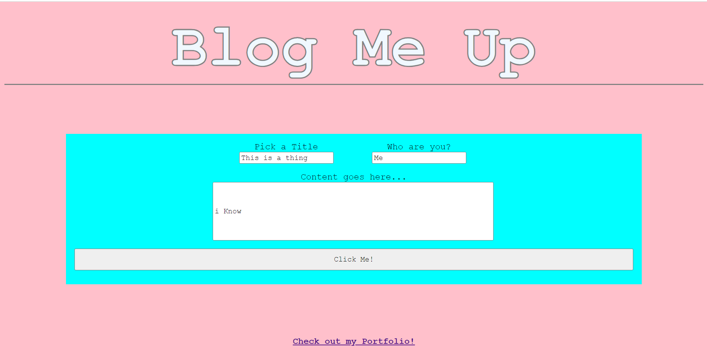

# Blog-Me-Up
The purpose of this repo is to store code for a blog/web diary

# Blog-Me-Up-Module-4

## Description
After going to the URL, a user will see a pink homepage with 'Blog Me Up' in thick white lettering with a grey outline and underline at the top of the page. Immediately beneath that is the aqua blue form box with 3 inputs for title, username, and content respectively. The submit button at the bottom of the form spans the width of the form. Upon submission, the user is navigated to the purple blog page with 'Blog Me Up...Do it' is in pink lettering in the middle of the page. To the left of the nav bar are 2 buttons for going back a page and toggling between theme colors. Directly beneath that are the local storage inputs.

## Details
The third module of the boot camp is to create a payroll tracker. The below bullets detail what was done to achieve this: 
- updated background color and title of page
- created functions to set and get local storage data
- created buttons to go back and toggle theme colors
- created a form on the homepage that leads to the blog page upon submission

## Installation
N/A

## Usage
Users can utilize this source to blog privately or keep a diary that will log each entry in order.

## Credits
N/A

## Acknowledgements
N/A

[Blog Stuff Now!](https://notsnowwhite.github.io/Blog-Me-Up/) 

